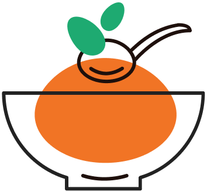

#  Cheffi - 재료 기반 레시피 추천 서비스

#### 📝 WEB : <https://cheffi.cf>

<br/>


<br/>

### 🍎 기획 계기

- 내가 **가진 재료**로 레시피를 찾고 싶어!
- 이 사이트, 저 사이트 레시피가 너무 많은걸..
- 재료가 오래돼서 버려야 하네..
  <br ><br>
  <hr/>
  ✅ 요리를 할 때 우리는 항상 <b>뭘 해먹을지</b>, <b>남는 재료</b>를 어떻게 처리할 지 고민합니다. 심지어 재료를 마저 쓰지 못하고 오래돼 <b>버리는</b> 경우도 많습니다.<br/>

  ✅ 따라서 현재 <b>가지고 있는</b> 재료를 최대한 활용하여 적절한 <b>레시피를 추천</b>하면 남는 재료도 줄이고, 레시피를 고민하는 시간도 줄어들 것이라고 생각해 이 서비스를 기획했습니다.
  <hr/>

### 🥗 목적

- [x] 재료를 기준으로 `원하는 레시피`를 찾아주는 것입니다

- [x] 없는 재료를 내가 `가진 재료로 대체`하여 재료의 과한 구매를 방지하는 것입니다

- [x] 여러 플랫폼의 레시피들 중 `적절한 것을 추천`해 주는 것입니다

### 🖥 Dependencies

- `typescript` : **오류 사전 방지** & **개발 경험** 향상
- `react-native` : **android & iOS** 크로스 플랫폼 개발
- `redux` : UI **전역 상태관리**
- `react-query` : **비동기적 서버 상태 관리** & Caching ・ Refetch
- `style-components` : UI 구성 라이브러리

### 🏃 Install

```bash
1. npm install
2. npx pod-install
3-1. (android) npm start android
3-2. (iOS) npm start ios
```

### 🎩 Developers

- 가동식 ([@Nesquitto](https://github.com/Nesquitto))
- 김소희 ([@elbica](https://github.com/elbica))
- 김준희 ([@zensen6](https://github.com/zensen6))
